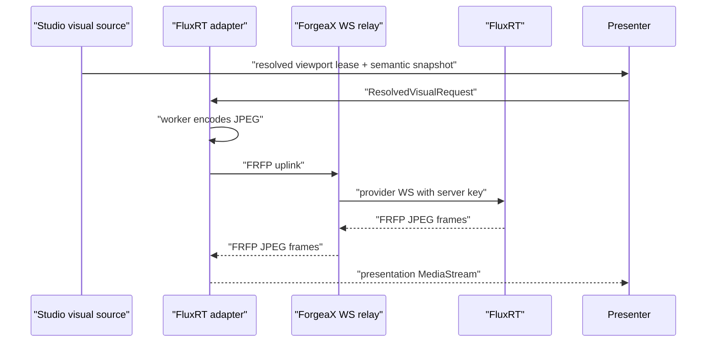

# FluxRT adapter protocol

FluxRT is intentionally private to `src/adapters/fluxrt.ts`. The generic
Presenter resolves required host inputs and gives the adapter an evaluated
effect frame plus a viewport lease. Transition ordering is carried in that
single reconcile batch; the adapter never receives gameplay actions or keys.

## FRFP framing

| Direction | Binary layout | Notes |
|:--|:--|:--|
| Uplink | `[u32 LE header length][JSON header][JPEG]` | `seq`, `ts`, projected prompt, seed, quality parameters |
| Downlink | `[u32 LE header length][JSON header][JPEG…]` | Header `sizes` splits every returned JPEG |

The adapter transfers `VideoFrame` objects to the encoder worker, bounds
network inflight work, and keeps a shallow output queue. The Presenter owns and
releases the viewport lease; the adapter releases its worker, socket, decoded
frame queue, and output tracks when the selected world epoch or backend changes.
