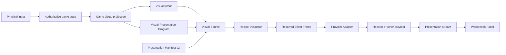

# Visual Presentation Program 架构调整计划

> [!IMPORTANT]
> **状态**：IMPLEMENTATION SPEC — Phase 1 in progress  
> **日期**：2026-07-16  
> **执行者**：后续新 Agent  
> **目标**：将 Diffusion Renderer 从“内置若干玩法规则的 LingBot 集成”调整为
> “跨后端 Visual Presentation Compiler”。游戏自由定义 Visual Recipes 和运行时
> Behavior Instances；插件只负责校验、合并、恢复，并由 Adapter 编译为 Reactor
> 或其他后端调用。

## 1. 结论

Diffusion Renderer 不是 Reactor SDK 的透明转发器，也不是替游戏解释按键和动作的
玩法框架。

它是一个深模块：

```text
game-owned presentation program
        +
game-owned declarative recipes
        ↓
deterministic recipe evaluation
        ↓
plugin-private resolved effect frame
        ↓
provider adapter
        ↓
Reactor SDK / FluxRT / future providers
```

游戏开发者不学习以下内容：

- Reactor command 名称与调用顺序
- `camera_pose` 六轴数组
- chunk、latent frame、y-down、translation normalization
- JWT、lease、Coordinator、WebRTC
- reconnect、ack、timeout、retry
- attention window 与 KV-cache wire command

游戏开发者只需要：

1. 把 gameplay state 投影为 `VisualIntent`。
2. 用一次原子 commit 发布 `VisualPresentationProgram`。
3. 在 `visual-presentation/manifest.json` 中定义 provider-neutral recipes。

> [!IMPORTANT]
> Phase 1 is an intentionally breaking contract cut. It updates the shared
> contract, Editor source, and plugin together, but does not migrate games or
> claim release readiness. Phase 2 owns application migration and user-facing
> validation.

## 2. 本次重构要修正的问题

当前未提交实现将 LingBot 参考应用的部分作者语言提升成了共享契约：

- `VisualPresentationLayerSchema` 固定 `idle/moving`。
- `VisualPresentationVerticalSchema` 固定 `jump/crouch/stand`。
- LingBot composer 显式判断 action key `jump` 与 `crouch`。
- vertical axis 被解释为 jump/crouch prose。
- `controls.orbit.radius` 成为所有游戏都能看到的特殊字段。
- Adapter 直接从 game-facing controls 推导 LingBot pose。

因此现在存在错误的因果链：

```text
game action key == plugin-known gameplay verb == fixed prompt/motion rule
```

目标因果链必须是：

```text
physical input
  → gameplay meaning
  → game projection
  → arbitrary recipe key
  → recipe effects
  → normalized effect frame
  → adapter compilation
```

例如 `<kbd>C</kbd>` 可以在不同游戏中分别表示：

- `cover-duck`
- `submarine-descend`
- `shield-block`
- `camera-mode-switch`

插件不得认识 `<kbd>C</kbd>`，也不得对这些 recipe key 做分支。

## 3. 锁定的领域模型

| 术语 | 精确定义 |
| :-- | :-- |
| **Visual Intent** | 游戏世界的 provider-neutral 可见事实，例如 scene、actors、semantic camera 和 gameplay actions。它不是 Provider 命令。 |
| **Visual Presentation Program** | 单一原子 ECS resource，承载 game-owned signals、active behavior instances、desired lifecycle 与 transition journal。 |
| **Visual Recipe** | `visual-presentation/manifest.json` 中静态、版本化、provider-neutral 的表现定义。 |
| **Visual Behavior Instance** | 某个 Visual Recipe 的运行时激活实例；有唯一 `instanceId` 和可选 bindings/parameters/intensity。 |
| **Visual Transition** | Behavior 的 `enter`、`exit` 或 `trigger` 有序事件。它不重建 durable active state。 |
| **Visual Signal** | 游戏投影出的命名 scalar/boolean/string；由 manifest entry 声明类型和范围。 |
| **Prompt Contribution** | Recipe 对某个 game-owned prompt slot 的 append 或 replace 文本。 |
| **Motion Track** | Recipe 对 closed, versioned effect target 的 normalized continuous value 或 keyframe timeline。 |
| **Resolved Effect Frame** | Presenter/recipe evaluator 产生的 plugin-private Adapter 输入；游戏永远不可见。 |
| **Adapter** | 将 Resolved Effect Frame 编译为具体 Provider command、prompt 和 media lifecycle 的实现。 |
| **Presentation diagnostics** | Provider 执行结果与降级信息；只供 Panel/调试，不得驱动 deterministic gameplay。 |

### 3.1 必须严格区分

Gameplay Action 与 Visual Behavior 不是同一概念。

- Gameplay Action 是世界事实，例如角色正在格挡。
- Visual Behavior 是游戏选择的表现请求，例如镜头轻微后退、Prompt 增加护盾火花。
- 游戏 projection 可以从一个 Gameplay Action 派生零个、一个或多个 Visual Behavior
  Instances。
- 插件不得通过 `actionKey` 自动猜测 recipe。

### 3.2 Phase 1 execution invariants

| Invariant | Rule |
| :-- | :-- |
| Continuity SSOT | `VisualIntent.scene.continuityKey` is the only continuity owner. Program must not duplicate it. |
| Atomic commit | A commit supplies desired durable state plus explicit triggers. The helper derives enter/exit transitions from the prior active set in one resource write. |
| Bounded idempotency | `operationId` receipts live in a bounded ledger. A retained ID has exact duplicate/conflict semantics; an evicted ID is a new operation. |
| Acknowledged waterline | Presenter advances a transition waterline only after the Adapter acknowledges the applied batch. |
| Clock ownership | Evaluator resolves declarative effects only. Adapter samples timelines from provider-confirmed presentation progress; wall-clock never advances effects independently. |

> [!WARNING]
> A failed Adapter batch must remain eligible for retry. Presenter must not
> advance the waterline merely because it constructed an effect frame.

## 4. 所有权

| Owner | Owns | Must not own |
| :-- | :-- | :-- |
| Game input/gameplay | 物理按键解释、game state、domain events | Provider 状态与 generated pixels |
| Game projection | Visual Intent、Program state、active instances、transitions | Reactor command 和 native pose |
| Game assets | prior images、signal declarations、baseline contributions、Visual Recipes | JWT、Provider URL |
| Visual Source | world epoch、resource observation、prior/catalog resolution、viewport/camera observation | Recipe 语义解释 |
| Presenter / Evaluator | validation、canonicalization、journal waterline、recipe merge、capability filtering | Provider wire command |
| Adapter | Provider units、command order、timeline cadence、reconnect、media | Gameplay input 和 ECS mutation |
| Panel | backend/profile/operator controls、diagnostics | Gameplay authority |

## 5. 目标数据流



> [!IMPORTANT]
> `Resolved Effect Frame` 必须保持在 Diffusion Renderer 私有层。把它暴露给游戏，会把
> normalized targets、capability 和 Adapter 调度重新变成另一套 SDK。

## 6. Game-facing Interface

### 6.1 Visual Intent

`VisualIntent` 保留世界事实：

```ts
interface VisualIntent {
  scene: {
    continuityKey?: string;
    summary?: string;
    location?: string;
    tags: string[];
    actors: VisualActor[];
  };
  camera?: VisualCameraObservation;
  actions: {
    active: VisualActiveAction[];
  };
}
```

以下字段从 Visual Intent 删除：

- fixed `controls.move`
- fixed `controls.look`
- fixed `controls.orbit`

这些输入通过 game-owned signals + recipes 映射为 Effect Targets。

### 6.2 Visual Presentation Program

单一 resource，原子记录 durable state 与 transitions：

```ts
interface VisualPresentationProgram {
  version: 1;
  revision: number;

  continuityKey?: string;
  creativeDirection?: string;

  lifecycle: {
    desiredPlayback: 'running' | 'paused';
    restartSequence: number;
  };

  signals: Record<string, boolean | number | string>;

  activeBehaviors: VisualBehaviorInstance[];

  journal: {
    nextSequence: number;
    dropped: number;
    entries: VisualBehaviorTransition[];
  };
}

interface VisualBehaviorInstance {
  recipeKey: string;
  instanceId: string;
  actorId?: string;
  targetId?: string;
  intensity?: number;
  parameters?: Record<string, boolean | number | string>;
}

type VisualBehaviorTransition =
  | {
      sequence: number;
      operationId: string;
      programRevision: number;
      type: 'behavior-enter';
      instance: VisualBehaviorInstance;
    }
  | {
      sequence: number;
      operationId: string;
      programRevision: number;
      type: 'behavior-exit';
      instanceId: string;
    }
  | {
      sequence: number;
      operationId: string;
      programRevision: number;
      type: 'behavior-trigger';
      instance: VisualBehaviorInstance;
    };
```

### 6.3 单一提交接口

```ts
interface VisualPresentationCommit {
  operationId: string;

  state: {
    continuityKey?: string;
    creativeDirection?: string;
    desiredPlayback: 'running' | 'paused';
    restartSequence: number;
    signals: Record<string, boolean | number | string>;
    activeBehaviors: VisualBehaviorInstance[];
  };

  transitions?: Array<
    | { type: 'enter'; instance: VisualBehaviorInstance }
    | { type: 'exit'; instanceId: string }
    | { type: 'trigger'; instance: VisualBehaviorInstance }
  >;
}

function commitVisualPresentation(
  store: VisualResourceStore,
  commit: VisualPresentationCommit,
): VisualPresentationReceipt;
```

可以提供 builder/helpers，但它们必须最终生成同一个 commit：

```ts
visualPresentation()
  .signal('input.move-y', 1)
  .begin({
    recipeKey: 'cover-duck',
    instanceId: 'player-posture',
    actorId: 'hero',
  })
  .commit(world, 'input:crouch:press:42');
```

不提供多个相互竞争的 resource mutation API。

### 6.4 Commit 幂等规则

- 同 `operationId` + 同 canonical payload：返回 duplicate receipt。
- 同 `operationId` + 不同 payload：抛 `idempotency-conflict`。
- 同 canonical durable state：不增加 revision。
- transitions 只分配一次 sequence。
- `instanceId` 在 active set 内唯一。
- duplicate enter：幂等 no-op。
- missing exit：幂等 no-op，并产生本地 diagnostic。
- trigger 不进入 `activeBehaviors`。
- state 与 transitions 在同一次 resource write 中提交。

### 6.5 高频 Signals

- Signal number 必须 finite。
- normalized signals 由 manifest schema 声明范围。
- canonicalization 统一量化，避免浮点噪声每帧增加 revision。
- canonical durable state latest-wins。
- transitions 永不 coalesce。

## 7. Presentation Manifest v2

目标路径保持：

```text
.forgeax/games/{slug}/visual-presentation/manifest.json
```

采用一次性破坏式升级，不保留 v1 runtime shim。

```ts
interface VisualPresentationManifest {
  version: 2;
  entries: VisualPresentationEntry[];
}

interface VisualPresentationEntry {
  continuityKey: string;
  signals: VisualSignalDeclaration[];
  baseline: VisualEffectBundle;
  recipes: VisualRecipe[];
}

interface VisualSignalDeclaration {
  key: string;
  type: 'boolean' | 'number' | 'string';
  default: boolean | number | string;
  min?: number;
  max?: number;
}

interface VisualRecipe {
  key: string;
  priority?: number;
  enter?: VisualEffectBundle;
  active?: VisualEffectBundle;
  exit?: VisualEffectBundle;
  trigger?: VisualEffectBundle;
}

interface VisualEffectBundle {
  prompt?: VisualPromptEffect[];
  motion?: VisualMotionTrack[];
}
```

### 7.1 不允许 Recipe 嵌套

- Recipe 不 include 其他 Recipe。
- Recipe 不动态激活其他 Recipe。
- 游戏通过同时发布多个 Behavior Instances 完成组合。
- 这样消除 cycle、隐式 activation 和难以追踪的优先级传播。

### 7.2 Prompt Effects

```ts
interface VisualPromptEffect {
  id: string;
  slot: string;
  text: string;
  mode: 'append' | 'replace';
  priority?: number;
  required?: boolean;
}
```

规则：

- slot 名称由游戏定义。
- baseline 和 recipes 使用同一套 slot。
- Recipe priority 只在 manifest 中定义，Instance 不可覆盖。
- Prompt 合并顺序与 input array 排列无关。
- append contribution 全部保留并 canonical dedupe。
- replace contribution 取最高 priority。
- 同 priority replace 取稳定 source ID 最小值。
- source ID 组成：`recipeKey + instanceId + phase + effectId`。

### 7.3 安全 Prompt 占位符

允许：

```text
{actor.id}
{actor.name}
{target.id}
{target.name}
{intensity}
{param.someKey}
```

不允许：

- JavaScript
- 条件表达式
- 函数调用
- Provider command
- 环境变量
- 任意对象路径

缺失 required placeholder 时拒绝该 Behavior Instance；缺失 optional placeholder 时产生
diagnostic 并移除对应 contribution。

## 8. Motion Tracks

### 8.1 Closed, versioned vocabulary

v1 targets：

```text
navigation.forward-rate
navigation.strafe-rate

camera.rotation.pitch-rate
camera.rotation.yaw-rate
camera.rotation.roll-rate

camera.translation.x-rate
camera.translation.y-rate
camera.translation.z-rate

camera.offset.x
camera.offset.y
camera.offset.z

camera.orbit.radius
```

新增 target 必须升级共享 schema。禁止：

- 任意 string target
- Provider namespaced target
- Reactor command
- raw pose tuple
- latent/chunk 参数

### 8.2 Track Schema

```ts
interface VisualMotionTrack {
  id: string;
  target: VisualMotionTargetV1;
  blend: 'add' | 'replace';
  priority?: number;
  required?: boolean;
  scaleByIntensity?: boolean;

  source:
    | { kind: 'constant'; value: number }
    | {
        kind: 'signal';
        key: string;
        scale?: number;
        invert?: boolean;
      };

  timeline?: {
    durationMs: number;
    interpolation: 'step' | 'linear';
    keyframes: Array<{
      at: number;
      value: number;
    }>;
  };
}
```

规则：

- 所有 motion value 为 normalized `[-1, 1]`。
- keyframe `at` 为 `[0, 1]`，严格递增。
- duration 有 schema 上限。
- camera targets 使用 camera-local frame。
- `rate` 表达持续运动。
- `offset` 表达相对目标偏移；Adapter 负责计算进入/恢复 delta。
- `scaleByIntensity` 必须显式开启；否则 Instance intensity 不修改 motion。
- Prompt 只能通过 `{intensity}` 读取 intensity。
- Motion add 求和后 clamp。
- Motion replace 取最高 priority，再按 source ID 稳定决胜。

### 8.3 Presentation Clock

- Timeline 按 Adapter 确认的 presentation progress 推进。
- pause 冻结 timeline。
- 浏览器 wall-clock 不单独推进效果。
- game simulation time 不决定 Provider 执行进度。
- chunk/frame cadence 始终是 Adapter 私有实现。

## 9. Recipe Evaluator

新增深模块：

```text
src/behavior-evaluator.ts
```

输入：

- Visual Intent
- Visual Presentation Program
- manifest entry/revision
- Presenter journal waterline
- selected Adapter capabilities

输出 plugin-private：

```ts
interface ResolvedEffectFrame {
  stamp: VisualWorldStamp;
  manifestRevision: string;

  prompt: ResolvedPromptContribution[];
  continuousMotion: ResolvedMotionValue[];
  transitions: ResolvedMotionTransition[];

  lifecycle: {
    desiredPlayback: 'running' | 'paused';
    restartToken?: string;
  };

  diagnostics: VisualEffectDiagnostic[];
}
```

Evaluator 负责：

- manifest/schema/reference validation
- signal type/range validation
- safe placeholder resolution
- active recipe resolution
- transition resolution
- prompt slot merge
- motion blend
- canonical sorting
- capability filtering
- prompt budget preflight
- unknown recipe isolation
- overflow/epoch/restart invalidation

## 10. Capability 规则

每个 Prompt Effect 与 Motion Track 有 `required`：

- supported required：正常执行。
- unsupported required：拒绝该 Behavior Instance，不终止其他 instances。
- unsupported optional：丢弃该 effect，并产生 structured degraded diagnostic。
- malformed manifest：整个 entry 加载失败。
- unknown active recipe：隔离该 instance，其他 recipes 继续。

跨后端只保证：

- 语义方向一致
- merge/order/lifecycle 一致
- capability fallback 一致

不保证像素级运动幅度一致。

## 11. Lifecycle

Lifecycle 不属于 Recipe：

```ts
interface VisualPresentationLifecycle {
  desiredPlayback: 'running' | 'paused';
  restartSequence: number;
}
```

- Recipe 不能 pause/resume/restart。
- Game commit 更新 desired lifecycle。
- Presenter/Adapter 与 authoritative provider state 对账。
- restart 是明确 command token，不依赖特殊 recipe key。
- Stop/dispose 仍由 host/Panel 负责释放 session、lease 和 media。

## 12. Recovery

### 12.1 Attach / Epoch / Overflow

- active snapshot 是 durable SSOT。
- attach/epoch 建立新的 sequence waterline。
- active effects 从 snapshot 恢复。
- enter/exit/trigger transient 不猜测、不重放。
- journal gap 记录 dropped transition diagnostic。

### 12.2 Reconnect

- recoverable reconnect 后读取 provider state。
- preserved conditions 存在时只对账当前 Resolved Effect Frame。
- conditions 丢失时执行 Adapter 私有 restage。
- 未完成 transient timeline 不从 edge 猜测恢复。

### 12.3 Continuity Change

- 新 Program snapshot 必须显式包含新 continuity 的 active behavior 集合。
- 旧 transient 全部取消。
- 插件不自动 carry matching recipe key。
- manifest revision 在一次 continuity 内 pin 住。
- 文件/HMR 变化只在显式 restart 或新 continuity 生效。

## 13. Adapter Seam

### 13.1 LingBot Adapter

只消费 Resolved Effect Frame：

- Prompt writer 只消费 merged prompt contributions。
- Navigation targets 编译为 `set_move_*`。
- Camera rate/offset/orbit 编译为唯一 camera-pose writer。
- 每个有效 provider progress tick 最多发送一次 pose。
- timeline 重采样、3 latent packing、y-down 与 orbit 数学全部私有。
- 无 active pose 时只发送一次 pose release。
- 生命周期、image/prompt/seed/start 顺序私有。
- JWT、WebRTC、reconnect、attention/KV 私有。

Adapter 代码不得出现：

```text
jump
crouch
stand
KeyC
Space
```

### 13.2 FluxRT Adapter

- 消费 merged prompt contributions。
- 声明支持的 effect target 集合。
- 对不支持 target 执行 required/optional 策略。
- 保留自己的 viewport/JPEG/WS transport。

## 14. Diagnostics

游戏只能得到本地 commit receipt：

```ts
interface VisualPresentationReceipt {
  operationId: string;
  disposition: 'accepted' | 'duplicate';
  revision: number;
  transitionSequences: number[];
}
```

游戏不能读取：

- Provider command ack
- chunk index
- camera-pose active
- Provider current action
- generated frames
- retry/reconnect status

这些信息进入 plugin-private diagnostics，Panel 可展示，但 deterministic gameplay 不得读取。

## 15. 迁移范围

采用一次性破坏式迁移，不保留 dual-read 或 Adapter shim。

### 15.1 Contracts

修改：

- `packages/contracts/types/src/visual-generation.ts`
- `packages/contracts/types/src/visual-generation.spec.ts`

任务：

- 删除 fixed controls/layers/vertical。
- 新增 Visual Presentation Program。
- 新增 manifest v2 recipes。
- 新增 commit/receipt/idempotency。
- 新增 closed Motion Target vocabulary。
- 将 Provider-specific operator/status 字段移出 L0。

### 15.2 Editor Source

修改：

- `packages/editor/packages/edit-runtime/src/viewport/visual-source.ts`
- 对应 tests

任务：

- 读取单一 Program resource。
- snapshot stamp 携带 program revision/sequence。
- catalog cache pin manifest revision。
- host inputs 继续独立解析。

### 15.3 Diffusion Renderer

修改：

- `src/adapter.ts`
- `src/presenter.ts`
- `src/adapters/lingbot-world-2.ts`
- `src/adapters/lingbot-world-2-prompt.ts`
- `src/adapters/fluxrt.ts`
- `src/panel.tsx`

新增：

- `src/behavior-evaluator.ts`
- `src/effect-frame.ts`
- evaluator tests

删除：

- `isMoving` 固定 layer 选择
- jump/crouch action-key 分支
- vertical axis → gameplay verb
- Adapter 直接读取 game controls
- shared attention/KV/rotation Provider fields

### 15.4 Samples

迁移：

- `.forgeax/games/visual-probe`
- `packages/games/city-stroll`

Proof scenarios：

1. Preset A：`<kbd>C</kbd>` 激活 `cover-duck`。
2. Preset B：`<kbd>C</kbd>` 激活 `submarine-descend`。
3. `<kbd>Space</kbd>` 激活 `short-hop`。
4. `<kbd>O</kbd>` 激活 `wide-orbit`。
5. WASD/mouse 通过 manifest-declared signals 映射为 baseline motion tracks。

插件实现不得引用这些 keys 或 recipe names。

### 15.5 Docs / Domain Model

新增：

- `docs/decisions/0027-visual-presentation-program.md`
  - 明确 supersede ADR 0026。

更新：

- `CONTEXT.md`
- `GAME-DEVELOPER.md`
- `DESIGN.md`
- `REALTIME.md`
- agent-diffusion-renderer Skill/Design/profile-format/example
- ROADMAP

## 16. Milestones

### M1 — Contract Cut

- [ ] 定义 Program、Recipe、Effect 和 receipt schemas。
- [ ] 原子 commit + idempotency tests。
- [ ] 删除 fixed gameplay vocabulary。
- [ ] 建立 manifest v2 validation。

### M2 — Pure Evaluator

- [ ] 实现 prompt slot merge。
- [ ] 实现 motion blend。
- [ ] 实现 signal source。
- [ ] 实现 safe placeholders。
- [ ] 实现 capability required/optional。
- [ ] property tests 验证 permutation independence。

### M3 — Presenter Integration

- [ ] Source 读取 Program。
- [ ] Presenter 维护 waterline。
- [ ] attach/epoch/overflow/restart recovery。
- [ ] 输出 plugin-private Resolved Effect Frame。

### M4 — LingBot Compilation

- [ ] Effect targets → Reactor movement。
- [ ] Effect targets → single camera-pose writer。
- [ ] offset/timeline → provider cadence。
- [ ] lifecycle/provider state reconciliation。
- [ ] 删除所有 gameplay-key inference。

### M5 — FluxRT / Capability

- [ ] 声明 FluxRT target capability。
- [ ] Prompt contributions 投影。
- [ ] required/optional behavior diagnostics。

### M6 — Samples / E2E

- [ ] visual-probe 多语义 `<kbd>C</kbd>` proof。
- [ ] City Stroll migration。
- [ ] game → Program → Evaluator → Adapter → output integration。
- [ ] browser keyboard/mouse/lifecycle E2E。

### M7 — Docs / ADR / Skill

- [ ] 新 ADR supersede 0026。
- [ ] 更新 glossary。
- [ ] 更新 game developer guide。
- [ ] Skill authoring 改为 manifest v2 recipe。
- [ ] 删除 portable vertical/static/dynamic 旧说法。

## 17. 验证矩阵

| 维度 | 必测 |
| :-- | :-- |
| Atomicity | state + transitions 单次写入；无中间不一致 |
| Idempotency | duplicate operation、conflicting operation、key repeat |
| Active state | concurrent instances、duplicate enter、missing exit |
| Journal | strict order、capacity、overflow、waterline |
| Prompt | slot append/replace、priority、dedupe、placeholder、budget |
| Motion | add/replace、clamp、signal source、offset、timeline、intensity |
| Determinism | 输入 permutation 不改变 canonical output |
| Capability | required reject instance、optional degrade |
| Recovery | attach、epoch、reconnect、overflow、restart |
| Adapter | one pose per progress tick、release、stale generation |
| Freedom | 同一物理键在不同游戏激活不同 recipes |
| Isolation | 游戏和 shared contracts 不出现 Reactor command/pose/chunk |

## 18. 机械防回归

新增 check，扫描 Diffusion Renderer runtime：

```text
禁止 gameplay-specific literals:
  jump
  crouch
  stand
  KeyC
  Space

禁止 Provider details 出现在 game/shared:
  set_camera_pose
  set_prompt
  chunk_size
  latent
  camera_pose
  REACTOR_API_KEY
```

允许位置：

- Adapter implementation
- Provider-specific tests
- sample game bindings
- documentation examples

## 19. 执行纪律

新 Agent 必须：

1. 不修改本计划的锁定决策，除非先向用户报告冲突。
2. 不为旧 v1 schema 添加 compatibility shim。
3. 不把参考 React app 的 `StructuredScene` 直接搬进共享 contracts。
4. 不把 Behavior Recipe 变成任意脚本语言。
5. 不把 Provider diagnostics 暴露为 gameplay input。
6. 不在 Adapter 中判断 recipe key、action key 或物理按键。
7. 每个 milestone 完成后运行对应 tests，再进入下一个 milestone。
8. 保留用户工作树中的无关修改。

## 20. 非目标

- 完整复制 Reactor `LayeredSceneEditor`
- Clip capture/download
- arbitrary JavaScript recipe
- runtime condition/expression DSL
- Recipe 嵌套
- Provider-specific recipe fields
- raw pose authoring
- pixel-level cross-provider equivalence
- generated media 驱动 gameplay

## 21. 待审查细节

以下细节未阻塞架构方向，可在文档审查后继续 grilling：

- v1 target vocabulary 是否需要首轮加入 shake/recoil。
- normalized offset 在 FluxRT 上是否只做 optional degradation。
- Prompt placeholder 缺失时 required/optional 的默认值。
- duration 上限与 signal quantization 精度。
- operator diagnostics 的具体 UI。
- plan 文件最终命名与 ADR 0027 标题。
