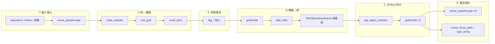

# 场景模板组 · 内部固定操作模式（TEMPLATE_PATTERNS）

> **读者**：要在编辑器里改模板、或设计新 template 的开发者 / Sino 文档维护者。  
> **与 [`TEMPLATES_INDEX.md`](./TEMPLATES_INDEX.md) 的分工**：INDEX 回答「用哪个模板、怎么连」；本文回答「每个模板**里面**反复出现的子流程是什么」。

---

## 1. 总体结论（先看这段）

当前 8 个 scene 模板不是 8 套独立算法，而是 **同一套「场景树流水线」上的不同插件**：

1. **规范化输入**（scene 树 → grid / 体素 / 点位）
2. **跑领域算法**（建筑/道路/湖/装饰…）
3. **把 grid 结果挂回 scene 树**（`grid2node` + `add_child`）
4. **给子区域打资产属性**（嵌套 `TileAssetName` / `ObjectAssetName`）
5. **拆主产物 vs Rest**（`alg_region_subtract`）
6. **导出标准五件套**（Scene / 主产物 / Rest / 主 Path / RestPath）

新模板若要「长得像现有模板」，应复用上述 6 步，而不是重新发明端口命名或输出形态。

---

## 2. 三个复用嵌套子组（所有模板的「零件库」）

大模板通过 `__group__` + `_nestedGroups` 内联以下子组。**不要在大模板里手写 `scene_set_attribute` 链，应嵌子组。**

### 2.1 `TileAssetName`（地块类资产名）

**用途**：给 scene 子节点写入 `asset_name` + `asset_type=tile`。

```
in_0: scene ──→ scene_set_attribute(key=asset_name, value=外部 string)
              ──→ scene_set_attribute(key=asset_type, value="tile")
out_0: scene（已标注）
```

- 固定 `text_panel`：`asset_name` / `asset_type` / `tile`
- 对外暴露：`in_1` = 资产名字符串（tree），`in_0` = scene
- **用于**：AddBaseGrid 的 BaseAsset、PathConnection 的 RoadAsset、LakeRegions 的 AssetName 等

### 2.2 `ObjectAssetName`（物体类资产名）

**用途**：与 TileAssetName 同构，仅 `asset_type` 固定为 `"object"`。

- **用于**：PickOneBuilding / PickMultiBuildings 的 BuildingAsset、NaturalDecorationDistribution / PlaceOneDecoration 的 AssetName

### 2.3 `MultiNames`（批量命名）

**用途**：由前缀 + 数量生成字符串列表（`range_list`）。

```
in_3: Prefix（string） + in_1: Count（number）
  → range_list → out_1: Names（string list）
```

- **用于**：LakeRegions / NaturalDecorationDistribution 的 NamePrefix 链（多实例湖泊/装饰各用一名）

---

## 3. 通用六段流水线

以下模式在 **PickOneBuilding、PathConnection、LakeRegions、NaturalDecorationDistribution** 中高度同构；AddBaseGrid / BuildingStructures 是其子集或变体。



### 3.1 ① 输入接入 — `scene_passthrough`

| 作用 | 把外部连进来的 scene **原样分叉**，作为后续 explode/算法的统一入口 |
| 典型 exposed 口 | `in_1` Scene / `in_0` RootScene |
| 注意 | 每个模板入口通常有 **1 个** passthrough；输出阶段还有 **3–4 个** passthrough 作抽头 |

**固定操作**：外部 scene 只连一次 passthrough，不要在组内多处直接接外部线。

### 3.2 ② 树 → 栅格 — `node_explode` → `rect_grid` → `voxel_slice`

| 节点 | 作用 |
|------|------|
| `node_explode` | 把 scene 树展开为可计算的体素/区域集合 |
| `rect_grid` | 取场景包围盒，生成对齐 grid |
| `voxel_slice` | 在指定 z 层切片的 0/1 区域栅格 |

**固定操作**：这三步顺序在「在空地上铺东西」类模板中 **几乎不变**，是「从 scene 提取几何」的标准 front-end。

**BuildingStructures 变体**：explode 后走 `alg_region_outline` / `alg_region_bsp` 等 **结构专用**算法，而非 point scatter。

### 3.3 ③ 领域算法 — 各模板唯一差异点

| 模板 | 核心 alg / 特殊 op | 输入要点 |
|------|-------------------|---------|
| AddBaseGrid | `rect_grid` + `add_child`（无复杂 alg） | Width/Height/BaseName |
| PickOneBuilding | `alg_point2rect` + `alg_region_blocky_carve` | Point + 宽高 |
| PlaceOneDecoration | `alg_point2rect`（无 blocky 雕刻） | Point + footprint + 高度 |
| PickMultiBuildings | `alg_region_blocky_carve` + 多点 | points 列表 |
| BuildingStructures | `alg_region_outline` / `alg_region_bsp` / 多次 subtract | 上游 Building scene |
| PathConnection | `alg_topology_connect_points` + `points_to_grid` | **`in_3` POI 点列表**（`tree_merge` item 档）+ `in_2` Scene |
| NaturalDecorationDistribution | scatter 类 + `scene_merge_subtrees` | Density + seed |
| LakeRegions | `alg_points_scatter` + `alg_region_flood_grow` | Points 数量 + seed |

**注意**：算法层是唯一应大幅定制的地方；前后处理尽量复用第 ②④⑤ 段。

### 3.4 ④ 栅格 → 树 — `grid2node` + `add_child` + 资产嵌套组

**固定操作序列**：

1. `grid2node`：把 0/1 grid 转为 scene 子树节点（带 `name`）
2. `add_child`：挂到父 scene 的指定 path 下
3. 嵌套 **`TileAssetName` 或 `ObjectAssetName`**：`in_1` 接外部传入的资产名字符串

**命名约定**：

- 主产物节点名常由 `text_panel` 或 `grid2node.name` 口注入（如 `"rest"` 仅用于 Rest 分支）
- **资产名字符串 = 最终渲染图层名**（如「石路」「树」「grassland」）

### 3.5 ⑤ 主产物 vs Rest — `alg_region_subtract`

**几乎所有「占一块空地」的模板共有的拆分逻辑**：

```
full_scene (或 union 后的区域)
  ├─ subtract(主区域) → grid2node(name=主产物名) → out: 主产物 Scene
  └─ subtract 的剩余   → grid2node(name="rest")   → out: Rest Scene
```

| 输出语义 | 含义 | 下游接法 |
|---------|------|---------|
| **主产物** out（Building/Path/Lake/Decoration…） | 本层新铺的内容 | `tree_merge.item_N` |
| **Rest** out | 未被本层占用的空地 | 下一模板 `in_1` Scene |
| **Scene** out（整树） | 有时暴露完整树或中间态 | 调试 / 特殊链 |
| **Path / RestPath** out | `scene_focus_path` + `type_string` 生成的 **string 路径句柄** | 下游 `string_concat` 拼 `/outer_door` 等 |

**固定操作**：

- Rest 分支的 `grid2node.name` 常接固定 `text_panel("rest")`
- **主产物与 Rest 必须成对出现**，否则链式管线断档

### 3.6 ⑥ 输出抽头 — 多路 `scene_passthrough` + `scene_focus_path`

**标准「五可见 OUT」模式**（端口编号因历史略有差异，语义一致）：

| 语义 | 典型 customLabelEn | 生成方式 |
|------|-------------------|---------|
| 主产物 Scene | Building / Path / Lake / Decoration | subtract 后主分支 grid2node → passthrough |
| Rest Scene | Rest | subtract 后 rest 分支 → passthrough |
| 整树/中间 Scene | Scene | 可选 passthrough 抽头 |
| 主 Path | BuildingPath / PathPath / LakePath | `scene_focus_path`(主产物) → `type_string` |
| Rest Path | RestPath | `scene_focus_path`(Rest) → `type_string` |

**Path 句柄的固定操作**：

```
scene_focus_path.scene ← 目标 scene 子树
scene_focus_path.path  ← （通常内部固定，或由 focus 输出）
type_string.value    ← 运行时 path 字符串（如 /architecture_0/...）
```

下游 **禁止用 BaseName 猜 path**；必须接 `*Path` 口或 `scene_focus_path` 产物。

---

## 4. 各模板固定操作摘要

### 4.1 AddBaseGrid（起点，无 Rest 链）

| 阶段 | 固定操作 |
|------|---------|
| 输入 | `in_0` RootScene ← empty_scene；`in_2/3` 定 grid 尺寸；`in_4` BaseAsset ← TileAssetName |
| 核心 | `rect_grid` → `grid2node` → `add_child` → focus 到 BaseNode |
| 输出 | `out_1` BaseNode（focus 后单节点 scene）、`out_2` RootScene（整树）、`out_3` BaseNodePath |

**注意**：不产生 Rest；后续模板从 `out_1` BaseNode 起跑。

### 4.2 PickOneBuilding / PickMultiBuildings（建筑占位）

| 阶段 | 固定操作 |
|------|---------|
| 输入 | Scene + Point(s) + 宽高 + ObjectAssetName |
| 核心 | `alg_point2rect` 或 `alg_region_blocky_carve` |
| 输出五件套 | Building(s) / Rest / Scene / Building(s)Path / RestPath |

**PickMulti 串联**：`out_1`(Rest) → 下一实例 `in_6`(Scene)。

### 4.3 BuildingStructures（在 Building 上加工，无 Rest 口）

| 阶段 | 固定操作 |
|------|---------|
| 输入 | `in_0` ← 上游 **Building scene**（不是 Rest） |
| 核心 | 多次 `alg_region_subtract` + BSP/outline 切房间；生成 **`outer_door`** 子节点 |
| 输出 | `out_0` Scene（含结构）、`out_1` Rooms、`out_2` RoomsPath |

**注意**：无 Rest 输出；结构层只「细化」已有建筑。

### 4.4 PathConnection（双 scene 输入）

| 阶段 | 固定操作 |
|------|---------|
| 输入 | **`in_3` POI**（grid/point，常来自 focus 后的门）+ **`in_2` Scene**（可铺路的上游空间）——**必须不同源** |
| 核心 | `alg_topology_connect_points` |
| 输出 | Path + Rest（Non-Path）+ 双 Path 句柄 |

**静默空跑条件**：POI 悬空 → 整组无道路输出，下游全空。

### 4.5 PlaceOneDecoration（精准单点装饰）

| 阶段 | 固定操作 |
|------|---------|
| 输入 | `in_1` Scene ← 上游 **Rest**；`in_3` Point；FootprintWidth/Height + DecorationHeight |
| 核心 | `alg_point2rect`（**无** blocky_carve，矩形 footprint 精确贴合参考点） |
| 输出五件套 | Decoration / Rest / Scene / DecorationPath / RestPath |

**多实例串联**：`out_2`(Rest) → 下一实例 `in_1`(Scene)，每实例一个 Point。

### 4.6 NaturalDecorationDistribution / LakeRegions（自然地物）

| 阶段 | 固定操作 |
|------|---------|
| 输入 | `in_1` Scene ← 上游 **Rest**；NamePrefix ← MultiNames；AssetName ← Tile/Object 嵌套组 |
| 核心 | scatter + grow（湖）/ 散布（装饰） |
| 输出 | 主产物 + Rest + Path 五件套 |

**Lake 额外**：`in_2` Points 控制湖数量；**Decor 额外**：`in_2` Density。

---

## 5. 输入提取 vs 输出组装 — 对照表

### 5.1 从外部输入「提取规范信息」的方式

| 信息类型 | 固定提取方式 | 典型 exposed IN |
|---------|-------------|----------------|
| 上游 scene 树 | `scene_passthrough` 单点接入 | `in_0` / `in_1` Scene |
| 场景尺寸 | 直接接 `rect_grid.width/height` | AddBaseGrid `in_2/3` |
| 点位 | 接 alg 的 point / points 口 | Pick `in_3`；Multi `in_5` |
| 资产名（字符串） | 接 `type_string` 或嵌套组 `in_1` | `*Asset` / `AssetName` |
| 资产名（带 type 元数据） | 嵌套 Tile/ObjectAssetName | `in_4` / `in_5` / `in_14` |
| 批量名前缀 | 嵌套 MultiNames 的 Prefix | `in_0` NamePrefix |
| 随机性 | 接 alg 的 seed 或 `number_const` | `in_17` / `in_3` seed |
| POI 栅格 | 独立 grid 口，**不与 Scene 混为同一源** | PathConnection `in_3` |
| 路径句柄（下游用） | 不作为 IN；由本组 `*Path` OUT 产生 | — |

### 5.2 组装输出的固定模式

| 输出 | 组装方式 |
|------|---------|
| 主产物 scene | alg → grid2node(主名) → add_child → AssetName 嵌套 → passthrough |
| Rest scene | alg → subtract 剩余 → grid2node("rest") → passthrough |
| *Path string | scene_focus_path(对应 scene) → type_string.value |
| 整图汇总（组外） | 各组主产物 → `tree_merge` → `tree_flatten` → `scene_merge_subtrees` → `scene_output` |

---

## 6. exposed 端口设计惯例

1. **`in_N` / `out_N` 编号不透明**：语义看 `customLabelEn`，不看数字顺序  
2. **visible vs hidden**：日常只接 visible；hidden 为密度/步长/zRange 等高级项  
3. **access 类型**：scene 口多为 `item` 或 `tree`；资产名多为 `tree`（DataTree 包 string）  
4. **实例化稳定性**：`portName` 在 `instantiateTemplate` 后不变；仅内部 nodeId 重映射  
5. **嵌套组必须在 `_nestedGroups` 自包含**：缺一则 instantiate 失败或 inner view 空白  

---

## 7. 新模板合规检查清单

设计或审查新 template 时，逐项核对：

- [ ] 入口有 **scene_passthrough**（或 AddBaseGrid 等价单入口）
- [ ] 「占空地」类有 **explode → rect_grid → voxel_slice** front-end
- [ ] 主产物经 **grid2node + add_child** 挂树
- [ ] 资产名经 **TileAssetName / ObjectAssetName** 嵌套组写入，而非裸 text
- [ ] 「占空地」类有 **alg_region_subtract** 产出 **Rest**
- [ ] 可见 OUT 至少含：**主产物 scene + Rest scene + 主 Path**（推荐五件套齐全）
- [ ] Rest 的 grid2node 名与 Rest out 的 customLabelEn 一致
- [ ] 需要外部连线的 scene 口在 visible IN 中且文档标注 **必接**
- [ ] `_nestedGroups` 与 `__group__` 成员 id / groupId 一致
- [ ] instantiate + execute 后：本组 `outputs/<G>/` 存在、主产物 children 非空

---

## 8. 参考：各模板规模一览

| 模板 | 节点数 | 嵌套子组 | visible IN | visible OUT |
|------|--------|---------|------------|-------------|
| AddBaseGrid | 7 | TileAssetName | 5 | 3 |
| PickOneBuilding | 26 | ObjectAssetName | 7 | 5 |
| PlaceOneDecoration | 25 | ObjectAssetName | 7 | 5 |
| PickMultiBuildings | 28 | ObjectAssetName | 8 | 5 |
| BuildingStructures | 43 | Tile×2 + MultiNames | 4 | 3 |
| PathConnection | 26 | TileAssetName | 5 | 5 |
| NaturalDecorationDistribution | 31 | MultiNames + ObjectAssetName | 6 | 5 |
| LakeRegions | 30 | MultiNames + TileAssetName | 5 | 5 |

---

## 9. 相关文件

| 文件 | 内容 |
|------|------|
| [`TEMPLATES_INDEX.md`](./TEMPLATES_INDEX.md) | 模板选型、链式串联、CLI |
| `<Name>/README.md` | 单模板端口、示例 ops、验证要点 |
| `backend/src/lib/templateOps.ts` | instantiate 时的 id 重映射与 createGroup 顺序 |
| `groups/scene/TileAssetName/` 等 | 嵌套子组源码（可被多个模板复制内联） |
