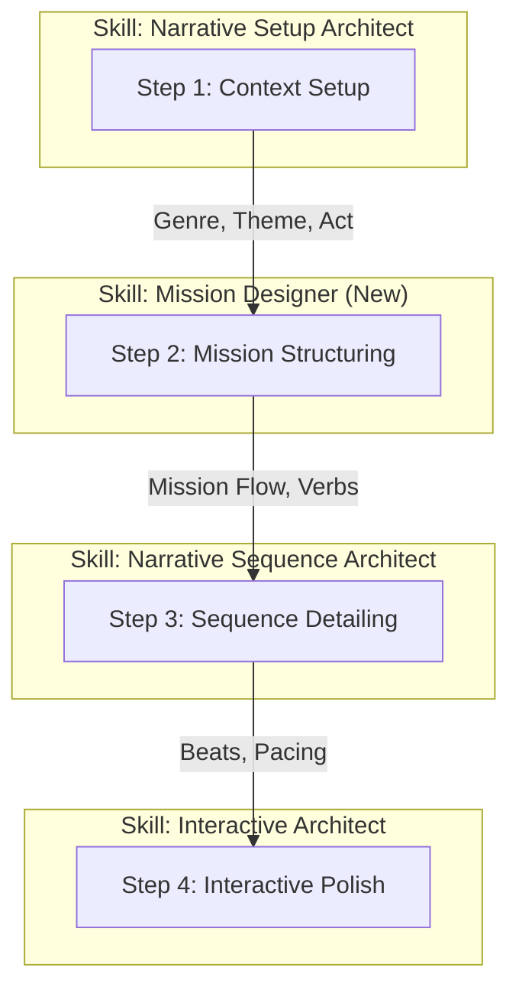

# USC 任务设计管线 (Mission Design Pipeline)

本文档定义了如何利用 USC 叙事 Skill 库，从零开始搭建符合 *Playcentric Approach* 的游戏任务。本管线强调**玩法与叙事的深度结合**，确保每一个任务既有故事深度，又好玩。

## 核心理念

任务 (Mission) 不是单纯的剧本，而是**玩家体验的容器**。
*   **输入**: 剧情大纲、角色动机、核心机制。
*   **输出**: 结构化的任务设计文档 (GDD Ready)。

---

## 管线流程图 (The Pipeline)

---

## 详细步骤说明

### Step 1: 宏观情景定义 (Macro Context)
**目标**: 确定任务在整个游戏中的位置和作用。
**使用 Skill**: `skills/lab_prompts/narrative_setup_architect.md`

*   **Action**: 运行 `narrative-setup-architect`。
*   **关键输入**:
    *   **Inciting Incident**: 这个任务是如何被触发的？
    *   **Stakes**: 为什么玩家必须做这个任务？（筹码是什么？）
    *   **Protagonist State**: 主角此刻的 Want (欲望) 和 Need (需求) 是什么？
*   **输出**: 任务的叙事背景和情感基调。

### Step 2: 任务骨架构建 (Mission Structuring)
**目标**: 将叙事背景转化为游戏任务结构。
**使用 Skill**: `skills/lab_prompts/mission_designer_skill.md`

*   **Action**: 运行 `mission-designer`。
*   **关键输入**:
    *   **Mission Type**: 是主线 (Need驱动) 还是支线 (Want驱动)？
    *   **Core Verbs**: 玩家在这个任务里具体做什么？（射击、解谜、对话？）
    *   **Step 1 的输出**: 结合背景故事。
*   **输出**: 包含 Hook -> Twist -> Climax 的 JSON 任务大纲。

### Step 3: 序列与节奏细化 (Sequence Detailing)
**目标**: 填充任务骨架，设计具体的关卡节奏。
**使用 Skill**: `skills/lab_prompts/narrative_sequence_architect.md`

*   **Action**: 针对 Step 2 输出中的每一个主要环节（如“潜入基地”），运行 `narrative-sequence-architect`。
*   **关键输入**:
    *   **Pressure Mapping**: 哪里是高压区（战斗），哪里是低压区（叙事）？
    *   **Information Distribution**: 关键剧情在哪里通过什么方式（无线电、环境、过场）交代？
*   **输出**: 详细的节拍表 (Beat Sheet)，标注了玩法密度和叙事密度的 2:1 关系。

### Step 4: 交互与分支打磨 (Interactive Polish)
**目标**: 增加玩家的代理感 (Agency)，设计有意义的选择。
**使用 Skill**: `skills/lab_prompts/interactive_architect_skill.md`

*   **Action**: 检查任务中的关键节点。
*   **关键输入**:
    *   **Agency Check**: 玩家是否觉得自己在扮演主角？
    *   **Meaningful Choice**: 支线任务中的选择是否涉及价值观冲突？
    *   **Failure State**: 失败后是否有有趣的叙事分支，而不是直接 Game Over？
*   **输出**: 最终完善的任务文档，包含分支逻辑树。

---

## 示例：设计一个“赛博朋克数据窃取”任务

1.  **Setup**:
    *   *Skill*: Setup Architect
    *   *Result*: 主角急需钱换义肢 (Want)，但潜意识里渴望推翻公司暴政 (Need)。任务是去窃取一家医药公司的数据。

2.  **Structuring**:
    *   *Skill*: Mission Designer
    *   *Result*: 
        *   **Type**: 支线 (赚外快)。
        *   **Verbs**: 潜行, 骇入。
        *   **Twist**: 数据不是钱，而是贫民窟的人体实验记录。
        *   **Climax**: 带着数据逃离战斗机甲的追杀。

3.  **Sequencing**:
    *   *Skill*: Sequence Architect
    *   *Result*:
        *   **Phase 1 (低压)**: 潜入通风管道，听到员工抱怨公司（环境叙事）。
        *   **Phase 2 (中压)**: 骇入服务器，解谜小游戏。
        *   **Phase 3 (高压)**: 警报响起，逃亡。此时禁止长对话，只有急促的导航指令。

4.  **Polishing**:
    *   *Skill*: Interactive Architect
    *   *Result*:
        *   **Choice**: 
            A. 把数据卖给黑市商人（获得巨款，满足 Want，但实验继续）。
            B. 把数据公之于众（没钱，义肢损坏，但获得声望，满足 Need）。
